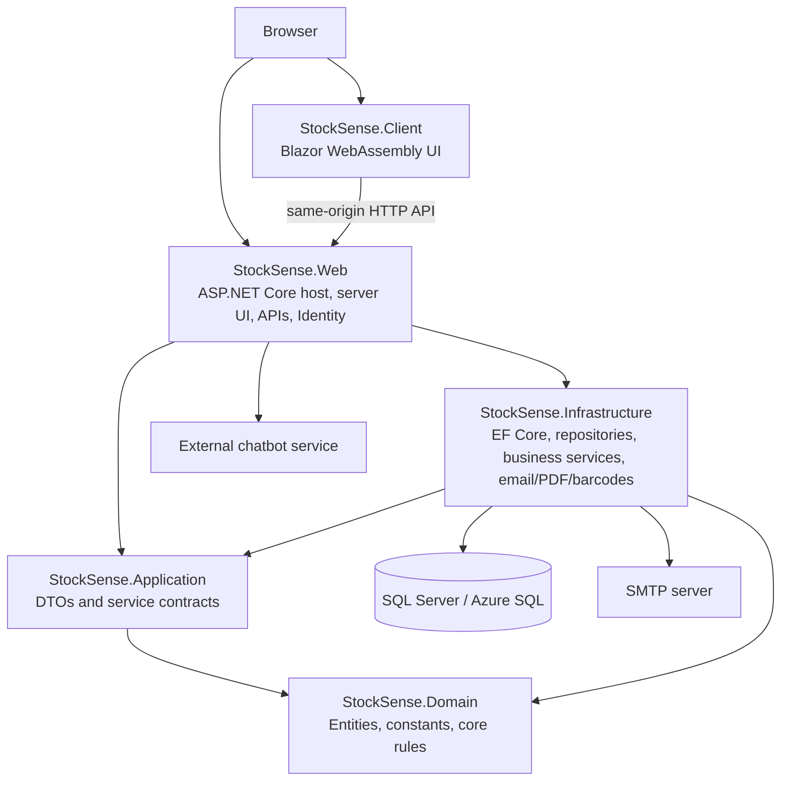
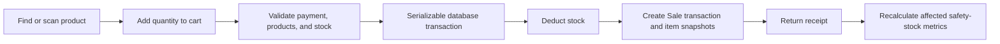

# StockSense: Project Logic, Architecture, and Capstone Title Ideas

## 1. Executive Summary

**StockSense** is a web-based operations and decision-support system for a motorcycle parts and repair shop. It brings together:

- motorcycle-parts inventory and supplier management;
- point-of-sale (POS) transactions and stock auditing;
- data-driven safety-stock, reorder-point, and target-stock calculations;
- automatic and manual supplier order-slip workflows;
- customer appointments and mechanic assignment;
- general motorcycle build requests and compatibility-aware engine build planning;
- work-order completion, payment recording, and receipt generation;
- historical and live product-sales reporting;
- product barcode/QR scanning and PDF generation;
- user, role, and account administration; and
- role-aware assistance through a separately hosted chatbot service.

The strongest capstone contribution is not simply digitizing inventory records. StockSense connects demand history, supplier lead times, replenishment decisions, POS activity, service work orders, and motorcycle build planning in one system.

> **Accuracy note:** The current repository implements statistical inventory policy and rule-based motorcycle build analysis. It does not contain a trained machine-learning forecasting model. “Data-driven,” “intelligent,” “decision-support,” and “optimization” are accurate descriptions; a title claiming machine learning or AI-based demand forecasting would overstate the current implementation.

---

## 2. Problem the System Solves

A motorcycle parts and repair shop commonly manages products, sales, service bookings, custom builds, stock replenishment, suppliers, and customer records through disconnected or manual processes. This creates several risks:

- products are reordered too late or in excessive quantities;
- stock decisions are based on intuition rather than observed demand;
- open supplier orders are overlooked and duplicate orders are raised;
- sales and purchase receipts do not produce a reliable inventory audit trail;
- parts selected for a motorcycle build may be incompatible or incomplete;
- service and build completion may not consistently deduct stock;
- historical sales are difficult to reconcile with live POS data; and
- staff, customer, and administrator functions are not centrally controlled.

StockSense addresses these problems through a shared transactional database, controlled workflows, explainable calculations, and role-based web interfaces.

---

## 3. Main Users and Permissions

| Role | Main responsibilities |
|---|---|
| **Customer** | Book appointments, view personal bookings, create motorcycle/build requests, use the engine-build planner, save drafts, submit builds, view personal build records, and use customer assistance. |
| **Employee** | Operate POS, process appointments and builds, assign mechanics, manage order slips, receive supplier deliveries, view inventory metrics and sales reports, and use employee assistance. |
| **Admin** | Perform employee functions plus manage users and roles, create/update/delete products, configure inventory policy, approve or cancel order slips, and manage administrative catalog data. |

Authentication uses ASP.NET Core Identity cookies. Accounts require confirmation, cookies use a 15-minute sliding lifetime, failed logins are locked after five attempts, APIs return `401` rather than HTML login redirects, and requests are protected by antiforgery and rate limiting.

### Authorization caveat

The current mechanics, services, and pre-built-package controllers require authentication but do not restrict their modifying endpoints to staff or administrators. As written, an authenticated customer could call those APIs directly. This is a security gap to fix before deployment or defense.

---

## 4. Technical Architecture

StockSense targets **.NET 8** and uses a layered, hybrid Blazor architecture.



### Solution projects

| Project | Purpose |
|---|---|
| `StockSense.Domain` | Entities, domain constants, and work-order transition rules. It has no project dependencies. |
| `StockSense.Application` | Data-transfer objects and interfaces for core use cases. It depends on Domain. |
| `StockSense.Infrastructure` | EF Core SQL Server persistence, repositories, safety-stock and ordering logic, checkout, email, PDFs, and barcodes. It depends on Application and Domain. |
| `StockSense.Client` | Blazor WebAssembly layouts, pages, components, authentication state, and HTTP API calls. |
| `StockSense.Web` | ASP.NET Core host, server-rendered Blazor pages, controllers, Identity, dependency injection, middleware, and external chatbot proxy. |
| `StockSense.Tests` | xUnit unit and SQL Server integration tests. |

The web host enables both interactive server components and interactive WebAssembly components. The UI uses **BlazorBlueprint** components and primitives; its Tailwind-based styling is provided by the component library.

### Architectural caveat

The intended dependency direction resembles Clean Architecture, but `StockSense.Client` currently references `StockSense.Infrastructure`. A browser client should normally depend only on shared contracts/Application and Domain, not database or server infrastructure. MailKit/MimeKit references in the client are also unnecessary for a server-owned email concern.

---

## 5. Core Data Model

The EF Core context extends ASP.NET Core Identity and exposes 26 domain sets. The main groups are:

### 5.1 Inventory and suppliers

- **Product** — name, category, brand, selling price, unit cost, image, barcode, current stock, reorder target, supplier, and concurrency row version.
- **Supplier** — supplier details and the products/order slips associated with it.
- **ProductInventorySetting** — per-product and per-location calculation mode, demand estimate, lead time, review period, buffer days, service level, order quantity/package constraints, safety-stock limits, and manual overrides.
- **ProductInventoryMetric** — calculated demand/lead-time averages and deviations, safety stock, target stock, confidence, calculation stage, reason, and calculation timestamp.

Inventory settings and metrics use a unique `(ProductId, LocationId)` relationship so the design can support multiple stock locations, although the current POS configuration normally uses `MAIN`.

### 5.2 Sales and stock audit

- **Transaction** — invoice number, date, type, payment method, reference, employee/user, customer identity, location, service amount, and total.
- **TransactionItem** — product, quantity, unit price/cost, line total, stock before/after, requested quantity, lost sales, and optional order-slip receipt link.
- **CartItem** — client-side POS cart representation.

Transactions represent sales, purchase receipts, stock corrections, and other inventory movements. The item snapshots preserve the facts at the time of the movement instead of relying only on the product’s current values.

### 5.3 Supplier procurement

- **OrderSlip** — supplier, location, slip numbers, status, generated/approved/ordered/completed dates, remarks, totals, actors, and concurrency row version.
- **OrderSlipItem** — product, recommended/ordered/received quantities, unit cost, stock position, safety-stock/reorder/target snapshots, package size, and minimum order quantity.
- **PinnedSlip** — saved/pinned order-slip behavior used by the UI.

### 5.4 Appointments and work orders

- **Appointment** — customer, selected service, schedule, mechanic, status, notes, completion data, price, and optional completed transaction.
- **Mechanic** — mechanic information and availability/activity.
- **StoreService** — service catalog entry with price and related products.
- **BuildRequest** — customer’s general or engine build request, selected-parts payload, status, total, completion information, and optional transaction.

Appointments and build requests both act as work orders. A completed work order has a unique link to its sale transaction, preventing a second checkout from creating another sale.

### 5.5 Motorcycle build engine

- **BikeModel** — brand, model, year range, base displacement, horsepower, torque, and active state.
- **UpgradeCategory** — logical engine-part category and whether it is required.
- **UpgradePart** — links an inventory Product to a category and stores compatibility, requirements, conflicts, performance effects, cost/labor, reliability, maintenance, and stress metadata.
- **UpgradeStage** — motorcycle-specific package/stage with target performance, required categories, and recommended parts.
- **SynergyRule** — data model intended for part-combination effects.
- **CustomerBuild** — user-owned saved draft, selected bike/stage/parts, projections, validation, maintenance result, status, and optional submitted BuildRequest.

Some build relationships are stored as JSON arrays of IDs. This is flexible but reduces database referential integrity and makes malformed or stale identifiers possible.

### 5.6 Sales reporting and imports

- **ReportingProduct** — canonical product used for historical reporting.
- **HistoricalProductMapping** and **HistoricalMonthlyProductSale** — imported source identity and monthly quantities.
- **SalesImportBatch** — import metadata and SHA-256 identity for idempotency.
- **LiveProductMapping** — one-to-one link from a historical reporting product to a current Product, including the month when live POS data takes over.
- **SalesHistory** — additional historical sales representation retained in the domain.

---

## 6. End-to-End Business Logic

### 6.1 Product and inventory management

1. An authenticated user can browse products or find a product by barcode.
2. Administrators can create, update, upload/replace product images, change inventory values, print barcode PDFs, and delete products.
3. Inventory updates validate values and use row versions to detect stale edits.
4. A stock change produces an audit transaction; a price-only edit can produce a header audit without a stock line.
5. Images are decoded and validated, not trusted only by extension or content type.
6. Product stock mutations go through guarded add/deduct operations.

The barcode service generates an internal deterministic EAN-13 value and QR/barcode label PDF using ZXing and QuestPDF. The POS scanner uses the browser camera and an `html5-qrcode` script.

### 6.2 POS sale



The POS records the employee, customer details when provided, payment method, reference number, stock before/after, sale price, unit cost, and totals. Insufficient stock prevents the sale rather than silently creating negative inventory.

### 6.3 Safety-stock and replenishment calculation

StockSense calculates a per-product inventory policy using complete daily demand, including zero-demand days. Demand is taken from posted Sale transactions and includes recorded lost-sales quantity. Supplier lead-time observations come from completed order slips.

Supported service levels and Z-scores are:

| Service level | Z-score |
|---:|---:|
| 90% | 1.2816 |
| 95% | 1.6449 |
| 97.5% | 1.9600 |
| 98% | 2.0537 |
| 99% | 2.3263 |

The calculation matures with the available data:

| Usable history | Stage | Behavior |
|---|---|---|
| Fewer than 30 days | **ColdStart** | Uses estimated weekly demand converted to daily demand and a configurable buffer. |
| 30–59 days | **Learning** | Blends 50% observed demand with 50% initial estimate. |
| 60–89 days | **Learning** | Blends 70% observed demand with 30% initial estimate. |
| 90 days or more | **DataDriven** | Uses observed demand and its variability. |
| Manual mode | **Manual** | Applies configured manual safety stock/reorder point while still reporting observed metrics. |

Observed lead-time variability is used once at least five valid completed-order observations exist. Otherwise, configured default lead time is used.

Conceptually:

```text
Reorder point = expected demand during lead time + safety stock

Target stock = expected demand during (lead time + review period) + safety stock
```

The exact safety-stock formula depends on the stage and whether both demand and lead-time variability are available. Results are rounded upward and constrained by minimum/maximum safety stock, minimum order quantity, package size, and optional maximum stock level.

Recalculation runs transactionally, persists metrics and explanations, updates the product’s reorder target, and handles optimistic concurrency. It can run for one product, selected products, or all products.

### 6.4 Automatic supplier order slips

1. The system calculates inventory position using on-hand stock and relevant incoming/open-order quantities.
2. A product triggers replenishment when its inventory position is at or below the reorder point.
3. The suggested quantity raises inventory toward target stock.
4. Minimum order quantity is applied, then the result is rounded up to a full package size.
5. Maximum stock constraints can cap or eliminate the suggested order.
6. Products without valid suppliers/settings or with disabled automatic ordering produce warnings or are skipped.
7. Drafts are grouped by supplier, and open orders prevent duplicate demand from being ordered again.

The workflow is:

```text
Draft → Approved → Ordered → PartiallyReceived → Completed
   └──────────────→ Cancelled (subject to rules and reason)
```

- Employees and admins can create and process slips.
- Approval and cancellation are administrator-only.
- Receipt quantities cannot exceed the remaining ordered quantity.
- Partial receipts update only the affected products.
- Completing a supplier order can recalculate all products for that supplier because it adds a new lead-time observation.
- Receiving creates a PurchaseReceipt transaction, increases stock, links receipt lines to order lines, and updates the order atomically.
- Row versions prevent two users from receiving or changing the same stale order simultaneously.

Manual purchase drafts are also supported and use current database cost rather than trusting a client-supplied cost.

### 6.5 Customer appointment

1. A signed-in customer selects a service, date/time, and available mechanic where applicable.
2. The server rejects already-booked slots and creates a Pending appointment.
3. The customer can view personal bookings.
4. Staff can view all appointments, assign mechanics, and move the appointment through allowed statuses.
5. Only a Confirmed appointment can be completed.
6. Completion validates parts and stock, creates a Sale transaction, deducts consumed items, adds service charges, links the receipt, marks the appointment Completed, and recalculates inventory policy.

### 6.6 General motorcycle build request

The general build page lets customers select motorcycle/build information and inventory products, estimate the total, and submit a request. Staff can review builds, change valid statuses, update assigned products, and complete a confirmed build through the same transactional checkout logic used by appointments.

There are two submission paths in the current code:

- the engine-specific path validates product existence and stock server-side; and
- an older general `POST /api/builds` path accepts selected-parts JSON and total price from the client.

The older path should be hardened to revalidate and reprice everything on the server.

### 6.7 Compatibility-aware engine build planner

The newer engine build experience is a decision-support workflow:

1. Select an active motorcycle model.
2. Select an upgrade stage/package or build part-by-part.
3. Load only active parts compatible with the chosen model/category.
4. Validate part requirements, conflicts, required stage categories, and availability.
5. Show errors for invalid combinations and warnings for out-of-stock estimate items.
6. Calculate projected displacement, horsepower, torque, reliability, parts cost, labor cost, total cost, and the closest upgrade stage.
7. Calculate a stress factor, maintenance tier, oil/fuel recommendations, and component service intervals.
8. Save/update/delete an authenticated customer draft.
9. On submission, revalidate and reprice on the server, reject unavailable inventory, create a Pending BuildRequest, and link the saved CustomerBuild to it.

The projection adds each part’s configured effects and selected category-based synergy bonuses. Estimated labor currently uses a fixed rate of 500 currency units per hour. Maintenance becomes more frequent as displacement gain, horsepower gain, part count, reliability penalty, bottom-end stress, and valvetrain stress rise.

The `SynergyRule` table exists, but the current calculator uses hard-coded category combinations rather than those records. Moving synergy behavior into configured rules would make the engine easier to maintain and defend academically.

### 6.8 Work-order state and checkout rules

Generic status changes allow:

- Pending → Confirmed or Cancelled;
- Confirmed → Pending or Cancelled;
- Completed → Pending; and
- Cancelled → Pending.

Completion is deliberately excluded from the generic status endpoint. It must occur through checkout, which verifies that the work order is Confirmed, performs the stock and sale changes in one serializable transaction, and then recalculates inventory.

Allowing a Completed order to reopen as Pending is questionable because its linked sale remains. Checkout idempotency prevents another sale, but the business meaning should be clarified.

### 6.9 Sales reporting

StockSense can build one continuous monthly series from imported history and live POS transactions:

1. Historical monthly data belongs to a canonical ReportingProduct.
2. An administrator/staff user maps it to a current Product.
3. The cutover cannot be earlier than the month after the latest historical observation.
4. Historical quantities are used before the cutover month.
5. posted POS Sale quantities are used from the cutover month onward.
6. An unmapped reporting product remains historical-only; an unmapped live product remains live-only.

This prevents historical and live quantities from being double-counted in the same period.

### 6.10 Assistance chatbot

The application exposes a role-protected assistance endpoint for Customer, Employee, and Admin users. It identifies the user’s highest role, builds current product-sales context, and forwards the question to a configurable external HTTP service:

```text
POST {ChatbotBaseUrl}/api/chat
Request:  { "message": "...", "user_role": "Customer|Employee|Admin" }
Response: { "reply": "..." }
```

The chatbot implementation itself is not in this repository and must be hosted separately. Invalid responses, timeouts, and unavailable upstream services are converted to controlled API errors.

---

## 7. Main UI Routes

### Public/customer-facing

| Route | Purpose |
|---|---|
| `/` | Public home page |
| `/appointment` | Book an appointment |
| `/my-bookings` | View the signed-in customer’s appointments |
| `/build` | General motorcycle build request |
| `/build-engine` | Compatibility-aware engine build planner |
| `/my-builds` | View saved/submitted customer builds |
| `/assistance` | Customer assistance |

### Employee/admin-facing

| Route | Purpose |
|---|---|
| `/Dashboard` | Operational dashboard |
| `/admin/pos` | POS and barcode scanning |
| `/admin/stock` | Inventory and safety-stock dashboard |
| `/admin/orderslips` | Supplier order slips |
| `/admin/order-slips/{id}` | Order-slip details |
| `/admin/order-slips/{id}/receive` | Receive supplier delivery |
| `/admin/order-history` | Transaction/order history |
| `/admin/product-sales` | Historical/live sales reporting |
| `/admin/appointments` | Appointment processing |
| `/admin/builds` | Build work-order processing |
| `/admin/prebuilts` | Pre-built package management |
| `/admin/services` | Service catalog management |
| `/admin/management` | User and role administration |
| `/admin/assistance` | Employee/admin assistance |

---

## 8. API Areas

| API area | Main responsibility |
|---|---|
| `/api/Products` | Product catalog, barcode lookup/PDF, quote email, admin product/inventory/image CRUD |
| `/api/inventory` | Inventory dashboard, settings, and recalculation |
| `/api/order-slips` | Preview, draft/manual order, approve, order, cancel, receive |
| `/api/Appointment` | Bookings, slots, assignment, status, completion |
| `/api/builds` | General/engine build work orders, staff updates, checkout, customer history |
| `/api/build` | Engine catalog, validation, projection, maintenance, drafts, submission |
| `/api/prebuilts` | Pre-built package catalog and management |
| `/api/Services` | Store service catalog and related inventory products |
| `/api/Mechanics` | Mechanic catalog and management |
| `/api/Admin` | Users, employee creation, roles, blocking, deletion |
| `/api/Dashboard` | Employee/admin operational statistics |
| `/api/assistance` | Role-aware external chatbot proxy |
| `/api/User` and `/api/Auth` | Profile and authentication status |

---

## 9. External Libraries and Integrations

- **ASP.NET Core Identity** — users, roles, confirmation, cookies, lockout, recovery, and 2FA pages.
- **Entity Framework Core + SQL Server/Azure SQL** — persistence, transactions, migrations, row-version concurrency.
- **BlazorBlueprint** — styled UI components and headless primitives.
- **QuestPDF** — documents, receipts, and barcode-label PDFs.
- **ZXing.Net + SkiaSharp bindings** — EAN-13/QR generation.
- **ImageSharp** — secure product-image validation and processing.
- **MailKit/MimeKit** — SMTP account and quote/order email.
- **Browser camera / html5-qrcode** — POS barcode scanning.
- **External chatbot HTTP API** — role-aware assistance; implementation is outside this repository.

---

## 10. Data Integrity and Reliability Measures

Implemented protections include:

- serializable transactions for checkout and procurement workflows;
- retry strategies for transient SQL Server failures;
- optimistic concurrency through row-version fields;
- unique invoice, mapping, work-order transaction, and product/location constraints;
- server-side stock validation before work-order completion;
- idempotent work-order checkout through the existing transaction link;
- package/minimum/maximum ordering rules;
- historical/live sales cutover validation;
- import batch hashing for duplicate prevention;
- image size, signature, decode, and dimension validation;
- generic API errors rather than raw exception details from controller failures; and
- automatic safety-stock refresh after stock-affecting operations.

The application currently applies pending EF Core migrations during startup. This is convenient for development, but a controlled deployment migration is safer when multiple production instances may start at once.

---

## 11. Testing

The xUnit project covers:

- cold-start, learning, data-driven, and manual safety-stock math;
- service-level Z-scores, limits, invalid demand, and lead times;
- reorder triggers, incoming inventory, package rounding, quantity constraints, and order transitions;
- partial/complete receipts, atomic stock updates, retry behavior, and concurrency;
- stock correction and price audit behavior;
- work-order transition rules;
- build payload validation;
- sales reporting cutover rules;
- product image upload validation;
- administrator self-protection and role-change rollback;
- chatbot URL/options, authorization, role forwarding, validation, and upstream failures.

Some database integration tests require the `STOCKSENSE_TEST_SQL_CONNECTION` environment variable and are skipped when it is absent.

Run:

```powershell
dotnet test tests/StockSense.Tests/StockSense.Tests.csproj
```

---

## 12. Running the Application

Prerequisites:

- .NET 8 SDK;
- a reachable SQL Server or Azure SQL database;
- SMTP configuration if email workflows will be used; and
- the external chatbot service if assistance will be demonstrated.

Recommended development sequence:

```powershell
dotnet restore StockSense.slnx
dotnet ef database update --project StockSense.Infrastructure --startup-project StockSense.Web
dotnet run --project StockSense.Web
```

The default development launch profiles use `http://localhost:5222` and `https://localhost:7273`.

Secrets should be supplied through .NET user-secrets, environment variables, or a managed secret store—not committed configuration.

---

## 13. Current Risks and Recommended Improvements

### Critical before deployment

1. **Rotate and remove committed credentials.** The repository contains live-looking database and SMTP credentials in configuration/history. Do not reuse them. Move secrets to user-secrets/environment variables/Azure Key Vault and scrub Git history.
2. **Tighten API authorization.** Restrict mechanic, service, and pre-built mutations to Employee/Admin, and decide which operations must be Admin-only.
3. **Harden legacy build submission.** Never trust client-supplied selected-parts JSON or total price; validate, reprice, and check stock on the server.
4. **Disable production detail leakage.** Do not enable detailed errors globally; scope database developer diagnostics to Development.

### Architecture and correctness

5. Remove the Client → Infrastructure project reference and browser-side email packages.
6. Standardize timestamps as UTC; convert to Philippine time only for presentation. The current mixture of `Now`, `UtcNow`, and reflection-based Singapore-time assignment can cause reporting ambiguity.
7. Replace JSON ID arrays with relational join tables where compatibility, required parts, conflicts, and selected build parts need strong integrity.
8. Use the `SynergyRule` data model instead of hard-coded category names.
9. Clarify whether completed/cancelled work orders may reopen and what must happen to the linked transaction.
10. Align the `dotnet-ef` tool and EF Core package major versions.

### Operations and quality

11. Log server-side exceptions before returning the generic API error.
12. Move automatic migration execution into a controlled release step.
13. Add health checks, an environment template, seed/demo instructions, and container/deployment documentation.
14. Consolidate overlapping Azure deployment workflows and make CI run the actual test project.
15. Self-host/pin the barcode scanner library and define an appropriate Content Security Policy.
16. Add browser/end-to-end tests for role navigation, POS scanning, order receiving, appointment checkout, and engine-build submission.

---

## 14. Suggested Capstone Titles

### Best overall recommendation

**StockSense: A Data-Driven Inventory, Procurement, and Motorcycle Service Management System with Compatibility-Aware Build Planning**

Why it fits: it captures the statistical inventory policy, supplier ordering, service operations, and distinctive build engine without claiming unimplemented machine learning.

### Strong alternatives

1. **StockSense: An Integrated Motorcycle Parts Inventory and Service Management System with Safety-Stock Optimization**

2. **StockSense: A Web-Based Decision Support System for Motorcycle Parts Replenishment and Compatibility-Aware Engine Builds**

3. **StockSense: A Data-Driven Inventory and Work-Order Management Platform for Motorcycle Parts and Repair Shops**

4. **StockSense: An Intelligent Motorcycle Parts Inventory System with Automated Replenishment and Build Compatibility Analysis**

5. **StockSense: An Integrated POS, Inventory, Procurement, and Service Management System for Motorcycle Shops**

6. **StockSense: A Smart Stock Replenishment and Motorcycle Work-Order Management System Using Demand Analytics**

7. **StockSense: A Motorcycle Parts Inventory Decision-Support System with Adaptive Safety-Stock Calculation**

8. **StockSense: A Web-Based Motorcycle Shop Management System with Demand-Driven Inventory Control**

9. **StockSense: An Inventory Optimization and Custom Engine Build Planning System for Motorcycle Parts Retailers**

10. **StockSense: A Data-Driven Platform for Motorcycle Parts Inventory, Supplier Ordering, and Service Operations**

11. **StockSense: An Explainable Inventory Replenishment and Motorcycle Build Decision-Support System**

12. **StockSense: A Role-Based Motorcycle Parts Retail and Repair Management System with Smart Reordering**

13. **StockSense: A Unified Motorcycle Parts POS and Inventory System with Statistical Safety-Stock Management**

14. **StockSense: An Integrated Sales, Inventory, Appointment, and Build Management System for Motorcycle Service Centers**

15. **StockSense: A Compatibility-Aware Motorcycle Build and Inventory Management System with Demand-Based Replenishment**

### Shorter presentation-friendly options

- **StockSense: Smart Inventory for Motorcycle Shops**
- **StockSense: Smarter Stock, Service, and Builds**
- **StockSense: Motorcycle Inventory and Build Intelligence**
- **StockSense: Data-Driven Motorcycle Shop Management**
- **StockSense: Intelligent Parts and Service Operations**

### If the panel prefers a formal “development of” title

**Design and Development of StockSense: A Data-Driven Inventory, Procurement, and Motorcycle Service Management System with Compatibility-Aware Build Planning**

### Titles to avoid unless the system is expanded

Avoid titles such as:

- “AI-Powered Demand Forecasting”;
- “Machine-Learning-Based Inventory Prediction”; or
- “IoT-Based Real-Time Inventory.”

Those capabilities are not implemented in the current repository. The external assistance chatbot does not make the inventory calculation itself AI-based, and no IoT hardware integration is present.

---

## 15. Recommended Capstone Positioning

For the manuscript and defense, position StockSense as:

> **An integrated, explainable decision-support and transaction system for motorcycle parts retail and repair operations. It improves replenishment decisions using demand and supplier lead-time data, preserves inventory auditability through POS and procurement transactions, and reduces invalid motorcycle build selections through compatibility and performance rules.**

The most defensible evaluation areas are:

- stockout frequency before and after using calculated reorder points;
- difference between manual and system-suggested order quantities;
- time required to prepare and receive supplier orders;
- inventory record accuracy after POS and work-order checkout;
- number of incompatible/incomplete build combinations detected;
- appointment/build processing time; and
- usability results by Customer, Employee, and Admin role.

---

## 16. Important Source Locations

- Startup, security, dependency injection, and middleware: `StockSense.Web/Program.cs`
- Database sets and timestamp behavior: `StockSense.Infrastructure/Data/ApplicationDbContext.cs`
- Entity model: `StockSense.Domain/Entities/`
- Inventory calculation: `StockSense.Infrastructure/Services/SafetyStockMath.cs`
- Inventory recalculation: `StockSense.Infrastructure/Services/SafetyStockCalculationService.cs`
- Supplier ordering: `StockSense.Infrastructure/Services/OrderSlipWorkflowService.cs`
- Work-order checkout: `StockSense.Infrastructure/Services/WorkOrderCheckoutService.cs`
- Engine compatibility: `StockSense.Infrastructure/Services/CompatibilityEngine.cs`
- Engine projections: `StockSense.Infrastructure/Services/PerformanceCalculator.cs`
- API controllers: `StockSense.Web/Controllers/`
- Customer/admin WebAssembly pages: `StockSense.Client/Pages/`
- Server employee pages: `StockSense.Web/Components/Pages/Employee/`
- Tests: `tests/StockSense.Tests/`

